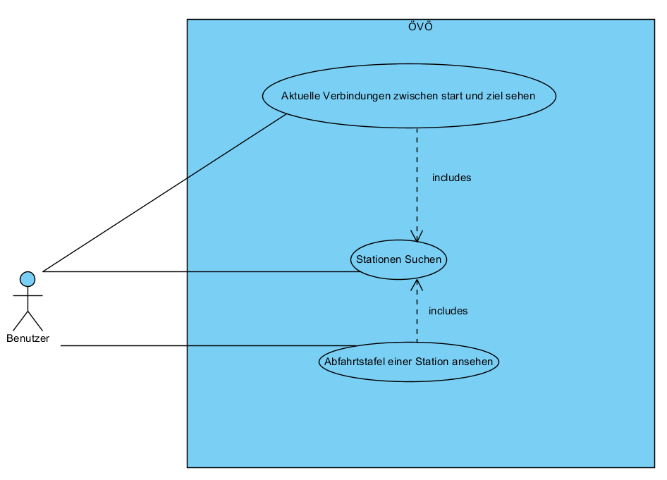
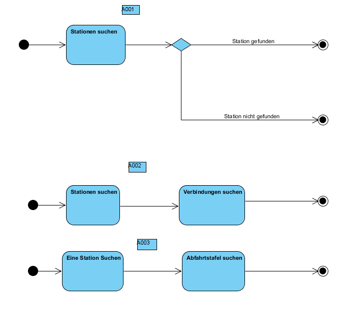

# ÖVÖ

_Till Kottmann, 23.05.2017_

## Zweck des Dokuments

Anleitung, Dokumentation und Information zum ÖVÖ ÜK Projekt von Till Kottmann

## Installation

Ein Installer (Installer.msi) für die aktuelle Version kann immer auf meiner [GitHub Releases Seite](https://github.com/deletescape/modul-318-student/releases) gefunden werden.
Dieser Installer kann einfach heruntergeladen und ausgeführt werden um ÖVÖ korrekt auf dem System zu installieren.

### Deinstallation

Das Programm kann über "Programme und Funktionen" in der Systemsteuerung wieder vom System entfernt werden.

## Management Summary

Der Zweck dieses Programmes, welches im ÜK zum Modul 318 entstanden ist, ist Aktuelle ÖV Verbindungen zwischen zwei Orten, so wie auch alle abfahrten von einer bestimmten Haltestelle anzuzeigen.
Umgesetzt wurde dies mit einem modernen Design und benutzerfreundlichen Hilfestellungen für die Stationensuche.
Der Benutzer soll die Möglichkeit haben Stationen mithilfe von Live-Vorschlägen effizient zu finden und sich dann Verbindungen anzeigen lassen.

## Umsetzung

### Anforderungen

|  ID  | Umgesetzt | Kommentar                                                                                |
|:----:|:---------:|------------------------------------------------------------------------------------------|
| A001 |     Ja    |                                                                                          |
| A002 |     Ja    |                                                                                          |
| A003 |     Ja    |                                                                                          |
| A004 |     Ja    | Eigene Umsetzung mit ListBox für Integration im Material Design                          |
| A005 |    Nein   | Aufwand um diese Funktion mit dem Design zu vereinbaren wäre für den ÜK zu gross gewesen |
| A006 |     Ja    | Link zu Google Maps auf Field Label                                                      |
| A007 |    Nein   |                                                                                          |
| A008 |    Nein   |                                                                                          |

### Eigene Features / Umsetzungen

 * Material Design
 * Auto Complete Funktion mit ListBox

## Testfälle

### Testfall "Station Suchen"

#### Vorbedingung

Das Programm muss gestartet sein und der Verbindungs Tab selektiert sein. Internetverbindung muss vorhanden sein

#### Testszenario

| Schritt |                  Aktivität                  |              Erwartetes Resultat             |
|:-------:|:-------------------------------------------:|:--------------------------------------------:|
|    1    | Benutzer gibt "Luz" im Abfahrtsort Feld ein | "Luzern" sollte an zweiter Stelle erscheinen |

### Testfall "Verbindung Suchen"

#### Vorbedingung

Das Programm muss gestartet sein und der Verbindungs Tab selektiert sein. Internetverbindung muss vorhanden sein

#### Testszenario

| Schritt |                     Aktivität                    |                          Erwartetes Resultat                         |
|:-------:|:------------------------------------------------:|:--------------------------------------------------------------------:|
|    1    |    Benutzer gibt "Luz" im Abfahrtsort Feld ein   |             "Luzern" sollte an zweiter Stelle erscheinen             |
|    2    | Im Dropdown den Eintrag Luzern Doppelt anklicken |   Das Dropdown schliesst sich und in der Textbox steht nun "Luzern"  |
|    3    |    Benutzer gibt "Zürich" im Zielort Feld ein    |              Das Dropdown mit den Vorschlägen erscheint              |
|    4    |     "Zürich HB" im Dropdown doppelt anklicken    | Das Dropdown schliesst sich und in der Textbox steht nun "Zürich HB" |
|    5    |              Den Such Button Klicken             |   Es sollten nun ca 5 Resulate erscheinen (Je nach tageszeit, usw)   |

### Testfall "Abfahrtsmonitor"

#### Vorbedingung

Das Programm muss gestartet sein und der Verbindungs Tab selektiert sein. Internetverbindung muss vorhanden sein

#### Testszenario

| Schritt |                     Aktivität                    |                                   Erwartetes Resultat                                  |
|:-------:|:------------------------------------------------:|:--------------------------------------------------------------------------------------:|
|    1    |     Benutzer gibt "Luz" im Stations Feld ein     |                      "Luzern" sollte an zweiter Stelle erscheinen                      |
|    2    | Im Dropdown den Eintrag Luzern Doppelt anklicken |            Das Dropdown schliesst sich und in der Textbox steht nun "Luzern"           |
|    3    |              Den Such Button Klicken             | Es sollten nun Resulate erscheinen (Anzahl ist je nach Tageszeit, usw unterschiedlich) |

### Testfall "GMaps"

#### Vorbedingung

Das Programm muss gestartet sein und der Verbindungs Tab selektiert sein. Internetverbindung muss vorhanden sein

#### Testszenario

| Schritt |                     Aktivität                    |                              Erwartetes Resultat                              |
|:-------:|:------------------------------------------------:|:-----------------------------------------------------------------------------:|
|    1    |    Benutzer gibt "Luz" im Abfahrtsort Feld ein   |                  "Luzern" sollte an zweiter Stelle erscheinen                 |
|    2    | Im Dropdown den Eintrag Luzern Doppelt anklicken |       Das Dropdown schliesst sich und in der Textbox steht nun "Luzern"       |
|    3    |        Auf das "Abfahrtsort" Label klicken       | Der Standardbrowser öffnet Google Maps mit einem Pin auf dem Luzerner Bahnhof |

## Material Design

Das ÖVÖ Programm ist im schönen und vorallem modernen [Material Design](https://material.io) von Google gehalten. Dies ist nur nöglich dank dem grossartigen [MaterialSkin](https://github.com/IgnaceMaes/MaterialSkin) von [Ignace Maes](http://ignacemaes.com).

## Use Cases

## Aktivitätendiagramme

## Anforderungen

|  ID  | Beschreibung                                                                  |
|:----:|-------------------------------------------------------------------------------|
| A001 | Stationen können gesucht werden                                               |
| A002 | Die nächsten 4-5 Verbindung zwischen den gewählten Stationen werden angezeigt |
| A003 | Alle Verbindungen von einer bestimmten Haltestelle als Abfahrtstafel sichtbar |
| A004 | Während der Eingabe erscheinen bereits Suchvorschläge                         |
| A005 | Verbindungen könenn zu beliebigen Zeitpunkten gesucht werden                  |
| A006 | Es ist ersichtlich wo sich eine Station befindet                              |
| A007 | Es kann nach Haltestellen in der nähe gesucht werdem                          |
| A008 | Gefundene Resultate können per Mail weitergeleitet werden                     |

[Coding Guidelines](http://www.dofactory.com/reference/csharp-coding-standards)

