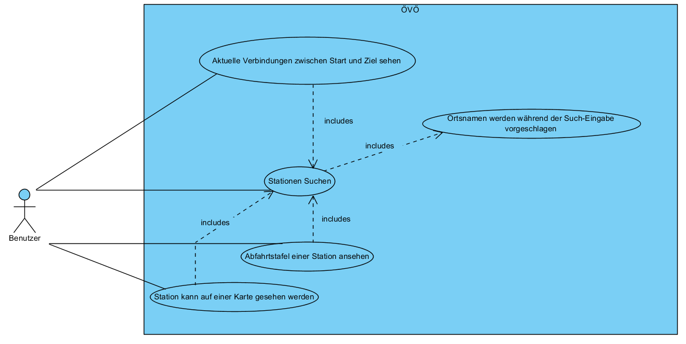

# ÖVÖ

_Till Kottmann, 23.05.2017_

## Zweck des Dokuments

Anleitung, Dokumentation und Information zum ÖVÖ ÜK Projekt von Till Kottmann

## Installation

Ein Installer (Installer.msi) für die aktuelle Version kann immer auf meiner [GitHub Releases Seite](https://github.com/deletescape/modul-318-student/releases) gefunden werden.
Dieser Installer kann einfach heruntergeladen und ausgeführt werden um ÖVÖ korrekt auf dem System zu installieren.

### Deinstallation

Das Programm kann über "Programme und Funktionen" in der Systemsteuerung wieder vom System entfernt werden.

## Management Summary

Der Zweck dieses Programmes, welches im ÜK zum Modul 318 entstanden ist, ist Aktuelle ÖV Verbindungen zwischen zwei Orten, so wie auch alle abfahrten von einer bestimmten Haltestelle anzuzeigen.
Umgesetzt wurde dies mit einem modernen Design und benutzerfreundlichen Hilfestellungen für die Stationensuche.
Der Benutzer soll die Möglichkeit haben Stationen mithilfe von Live-Vorschlägen effizient zu finden und sich dann Verbindungen anzeigen lassen.

## Umsetzung

### Anforderungen

|  ID  |  Umgesetzt | Kommentar
| ---- | ---------- |
| A001 |     Ja     |
| A002 |     Ja     |
| A003 |     Ja     |
| A004 |     Ja     | Eigene Umsetzung mit ListBox für Integration im Material Design
| A005 |     Nein   | Aufwand um mit diese Funktion mit dem Design zu vereinbaren wäre für den ÜK zu gross gewesen
| A006 |     Ja     | Link zu Google Maps auf Field Label
| A007 |     Nein   |
| A008 |     Nein   |

### Eigene Features / Umsetzungen

 * Material Design
 * Auto Complete Funktion mit ListBox

## Use Cases

## Aktivitätendiagramme

